# Conductor Engineering Log

This log explains how Conductor is being built, phase by phase: what changed, why, and how each change was verified. The roadmap lives in [plan.md](plan.md); this file is the story behind it.

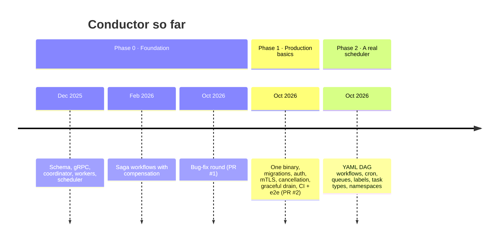

---

## Contents

1. [Phase 0: Foundation and the bug-fix round](#phase-0-foundation-and-the-bug-fix-round)
2. [Phase 1: Production basics](#phase-1-production-basics)
3. [Phase 2: A real scheduler](#phase-2-a-real-scheduler)

---

## Phase 0: Foundation and the bug-fix round

### What existed

Three services talking over gRPC, with Postgres as the queue:

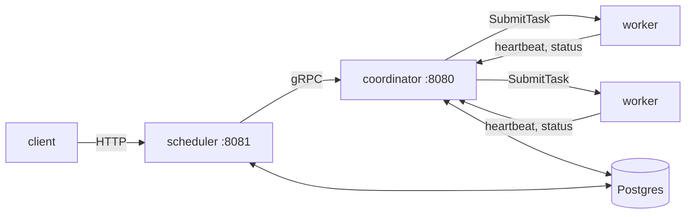

### What was broken

A code review turned up seven bugs, plus one more found while reading the compose file:

| # | Bug | Effect |
|---|---|---|
| 1 | Dispatch picked **one task per second**, cluster-wide | 30 tasks took at least 30 seconds, however many workers ran |
| 2 | Requeue kept `picked_at` set | Tasks waited 5 minutes for the stale cleanup |
| 3 | Tasks on a dead worker stayed `STARTED` | Lost forever |
| 4 | "Round-robin" iterated a Go map | Random order; `IsBusy` unused |
| 5 | Workflow input pasted into `sh -c` | `{"user_id":"1; rm -rf /"}` ran |
| 6 | README promised exponential back-off | The code used a fixed delay |
| 7 | Compiled binary committed | 8.8 MB in git |
| 8 | Every replica had `WORKER_ID=1` | Scaling workers did nothing |

### Throughput, before and after

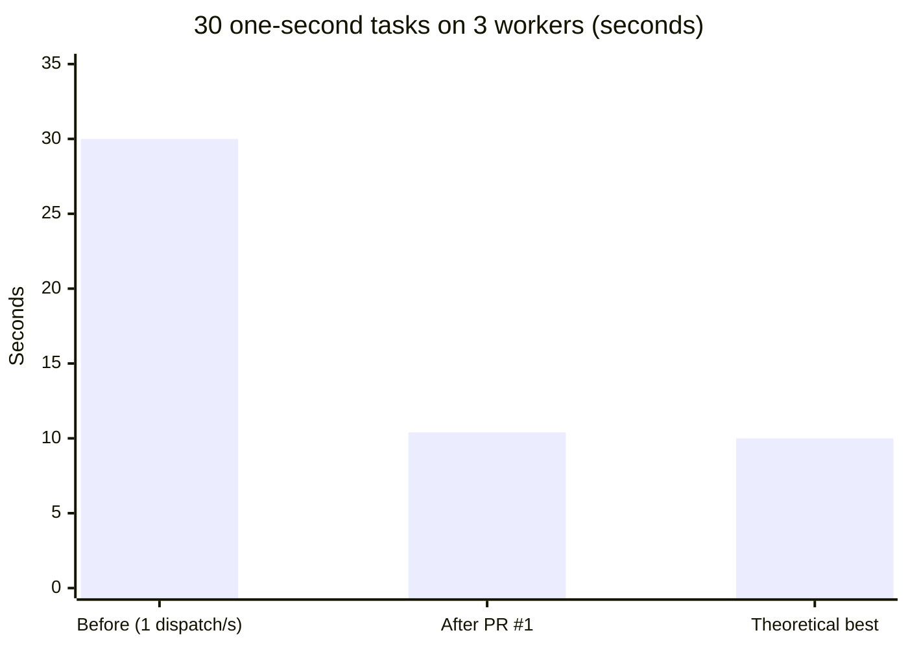

### Crash recovery, as verified by killing a worker

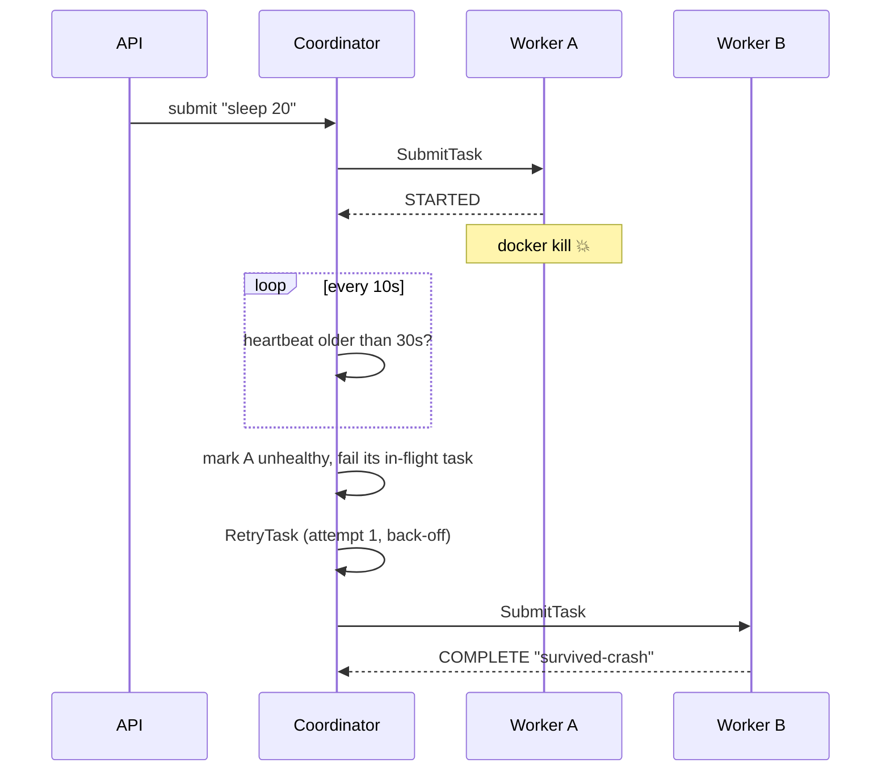

---

## Phase 1: Production basics

**Goal:** every change is tested automatically, and the system is safe to put on a network.
**Result:** PR #2. Every Phase 1 item is done; see the scorecard at the end of this section.

### 1. One binary, clearer roles

The four Dockerfiles and three `main` packages became **one binary with subcommands**. The HTTP service was renamed `api` because it never scheduled anything, and the stale-task cleanup moved into the coordinator, which leaves the API completely stateless.

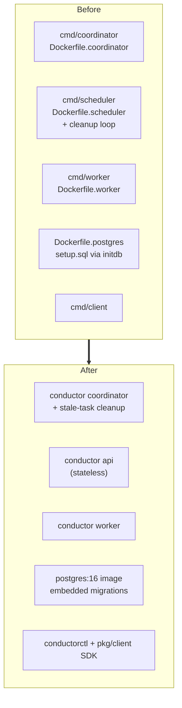

`pkg/app` owns each component's lifecycle (connect, migrate, serve, shut down), so `cmd/conductor/main.go` is tiny. That structure also makes Phase 2's single-process `dev` mode a few lines of code.

### 2. Schema migrations

`setup.sql` used to run once through Postgres' `initdb` hook, with no way to change the schema later. It is now an embedded, forward-only migration runner:

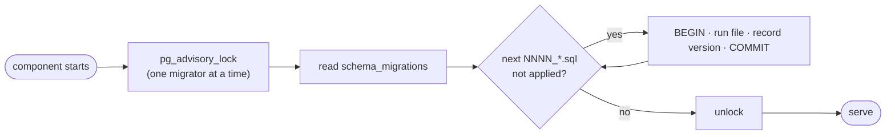

- Migration `0001` is **idempotent** (`IF NOT EXISTS`, `DO $$ … duplicate_object`), so databases created by the old `setup.sql` upgrade in place. This was verified against the real volume from Phase 0.
- The coordinator and the API both migrate on startup; the advisory lock makes that safe. A test runs three migrators concurrently.

### 3. A transactional data layer

Every query takes a `context.Context`, and `db.WithTx` runs a function inside a transaction. Starting a workflow (create run, create steps, create the first task, link them) is now atomic, and Phase 2's DAG engine depends on this.

```go
err := s.db.WithTx(ctx, func(tx *db.DB) error {
    wf, _ := tx.CreateWorkflow(ctx, ...)
    // ...steps, first task, links: all or nothing
})
```

### 4. Security layers

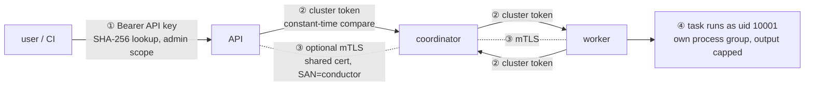

| Layer | Detail |
|---|---|
| ① API keys | `cnd_` + 256 random bits. Only a SHA-256 hash is stored (keys are random, so a slow KDF adds nothing). Admin keys manage keys. `CONDUCTOR_API_KEY` bootstraps the first one. |
| ② Cluster token | Required on **every** gRPC call in both directions, checked by interceptors with a constant-time comparison. Before this, anyone who could reach port 8080 could register a fake worker and receive every task. |
| ③ mTLS | Optional. All components share one cluster certificate with SAN `conductor`; clients verify that name rather than the dialed IP, so dynamic worker IPs just work. `scripts/gen-dev-certs.sh` plus `docker-compose.tls.yml` turn it on. |
| ④ Execution | Non-root container user, 1 MB output cap (the head and tail are kept, since errors usually appear at the end), 1 MB request cap, unknown JSON fields rejected. |

### 5. Cancellation

Killing `sh` alone isn't enough: `sh -c "sleep 60; echo"` leaves `sleep` running and holding the output pipe open. Workers start each task in **its own process group** and kill the whole group.

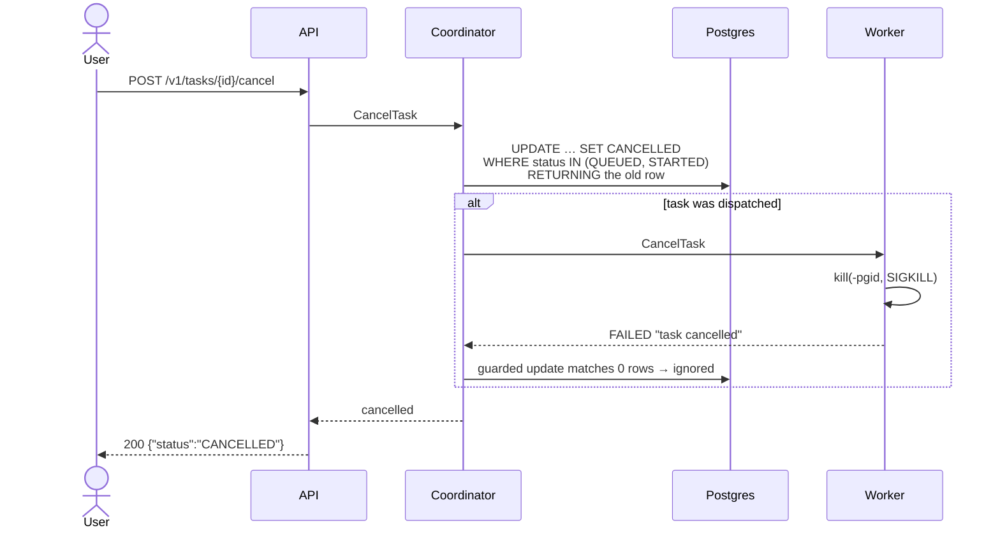

The guarded transitions from PR #1 (`WHERE status IN ('QUEUED','STARTED') AND picked_at IS NOT NULL`) are what make this safe: the killed process's failure report arrives *after* the cancel and changes nothing.

**Cancelling a workflow** sets `cancel_requested`, cancels the running step, and compensates the completed steps in reverse. The final status is `CANCELLED` rather than `FAILED`. If the running step finishes before the cancel lands, the completion handler sees the flag and compensates instead of starting the next step.

### 6. Graceful shutdown

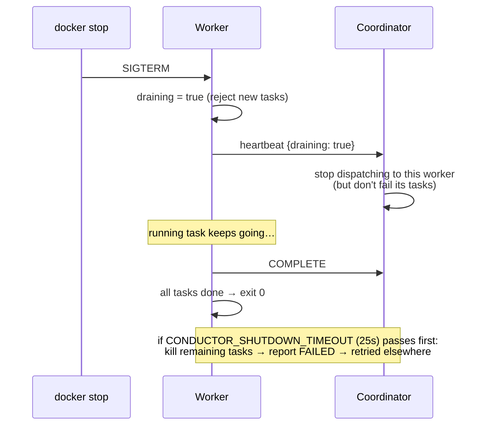

Compose gives workers `stop_grace_period: 30s`, a little longer than the drain timeout.

### 7. The task lifecycle, now complete

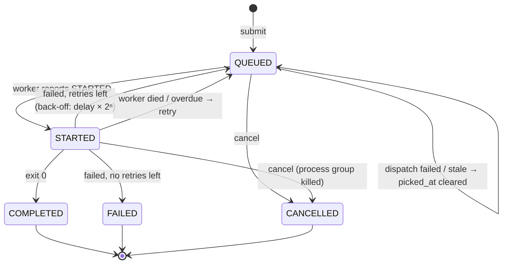

### 8. Testing: three layers, all automated

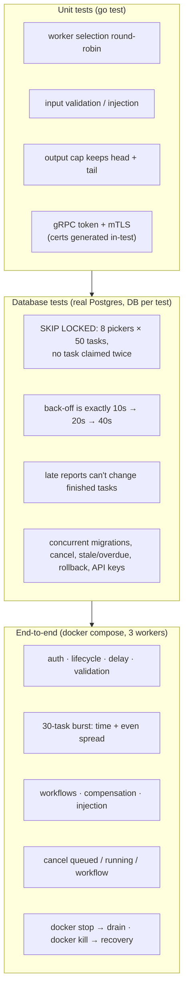

The e2e suite automates every check from Phase 0's manual verification. It finds the container running a task with `docker top`, so it can stop or kill precisely that worker.

### 9. CI pipeline

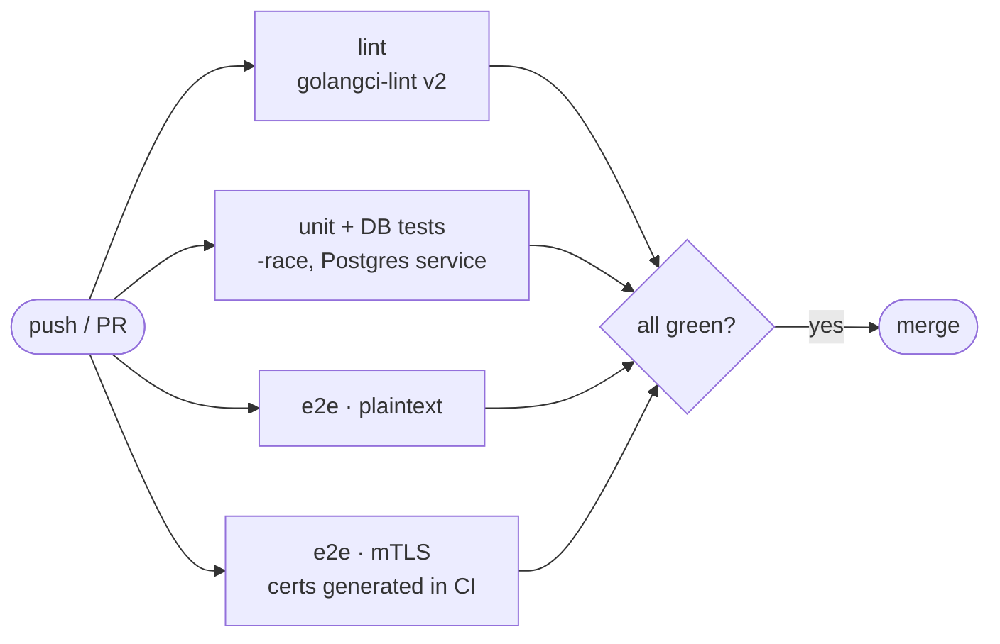

Running the e2e suite **over mTLS as well** matters: the secure configuration is the one most likely to break unnoticed, because developers rarely run it locally.

### 10. Results

Local run (Windows host, Docker Desktop, 3 workers):

| Suite | Result |
|---|---|
| Unit | ✅ coordinator, workflow, worker, security |
| Database (real Postgres) | ✅ 10 tests |
| E2E, plaintext | ✅ 14/14 in 102s (burst: 10.6s, split 10/10/10) |
| E2E, mutual TLS | ✅ 14/14 in 104s |
| golangci-lint | ✅ 0 issues |

### Design decisions

| Decision | Alternatives | Why |
|---|---|---|
| Hand-written migration runner (~100 lines) | golang-migrate | No new dependency, embedded in the binary, advisory-locked. Fits "Postgres is the only dependency". |
| DB tests use `CONDUCTOR_TEST_DATABASE_URL` | testcontainers-go | CI already has a Postgres service; avoids a heavy Docker-client dependency tree. |
| One shared cluster certificate | Per-component certs | Workers have dynamic IPs; verifying a fixed SAN keeps mTLS working without a cert per replica. |
| Cancel endpoint is `POST …/cancel` | `DELETE /tasks/{id}` | Cancelling doesn't delete anything; the task stays queryable. |
| Single binary pulled forward from Phase 2 | Keep 3 binaries | Every `main` was being rewritten anyway. |
| Shell tasks run as non-root | Root (old behaviour) | Least privilege; tasks needing root should use the container executor (Phase 2). |

### Phase 1 scorecard

| Item | Status |
|---|---|
| 1.1 Line endings, gofmt, lint config, Makefile, LICENSE (Apache-2.0) | ✅ |
| 1.2 CI, automated e2e, DB tests, (branch protection needs a repo admin) | ✅ / ⚠️ |
| 1.3 Migrations, config, slog, graceful shutdown | ✅ |
| 1.4 API keys, cluster token, mTLS, `.dockerignore`, `.env.example`, limits, `/v1` | ✅ |
| 1.5 Task and workflow cancellation | ✅ |

---

## Phase 2: A real scheduler

*In progress. This section is filled in as Phase 2 lands.*
