# Conductor Engineering Log

This log explains how Conductor is being built, phase by phase: what changed, why, and how each change was verified. The roadmap lives in [plan.md](plan.md); this file is the story behind it.

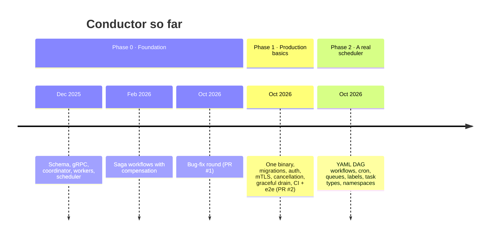
```mermaid
timeline
    title Conductor so far
    section Phase 0 · Foundation
        Dec 2025 : Schema, gRPC, coordinator, workers, scheduler
        Feb 2026 : Saga workflows with compensation
        Oct 2026 : Bug-fix round (PR #1)
    section Phase 1 · Production basics
        Oct 2026 : One binary, migrations, auth, mTLS, cancellation, graceful drain, CI + e2e (PR #2)
    section Phase 2 · A real scheduler
        Oct 2026 : YAML DAG workflows, cron, queues, labels, task types, namespaces
```

---

## Contents

1. [Phase 0: Foundation and the bug-fix round](#phase-0-foundation-and-the-bug-fix-round)
2. [Phase 1: Production basics](#phase-1-production-basics)
3. [Phase 2: A real scheduler](#phase-2-a-real-scheduler)

---

## Phase 0: Foundation and the bug-fix round

### What existed

Three services talking over gRPC, with Postgres as the queue:

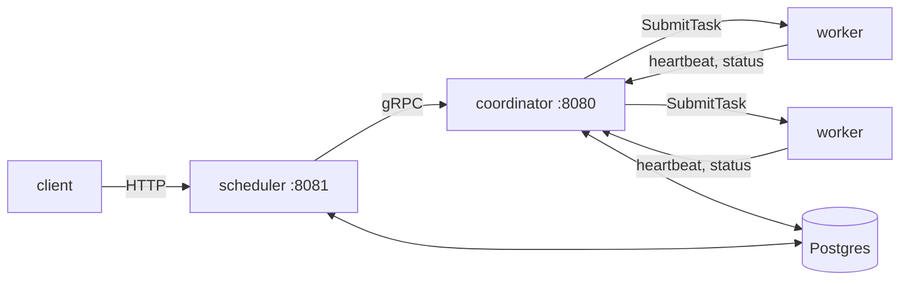
```mermaid
flowchart LR
    C[client] -- HTTP --> S["scheduler :8081"]
    S -- gRPC --> CO["coordinator :8080"]
    CO -- "SubmitTask" --> W1[worker] & W2[worker]
    W1 & W2 -- "heartbeat, status" --> CO
    CO <--> PG[(Postgres)]
    S <--> PG
```

### What was broken

A code review turned up seven bugs, plus one more found while reading the compose file:

| # | Bug | Effect |
|---|---|---|
| 1 | Dispatch picked **one task per second**, cluster-wide | 30 tasks took at least 30 seconds, however many workers ran |
| 2 | Requeue kept `picked_at` set | Tasks waited 5 minutes for the stale cleanup |
| 3 | Tasks on a dead worker stayed `STARTED` | Lost forever |
| 4 | "Round-robin" iterated a Go map | Random order; `IsBusy` unused |
| 5 | Workflow input pasted into `sh -c` | `{"user_id":"1; rm -rf /"}` ran |
| 6 | README promised exponential back-off | The code used a fixed delay |
| 7 | Compiled binary committed | 8.8 MB in git |
| 8 | Every replica had `WORKER_ID=1` | Scaling workers did nothing |

### Throughput, before and after

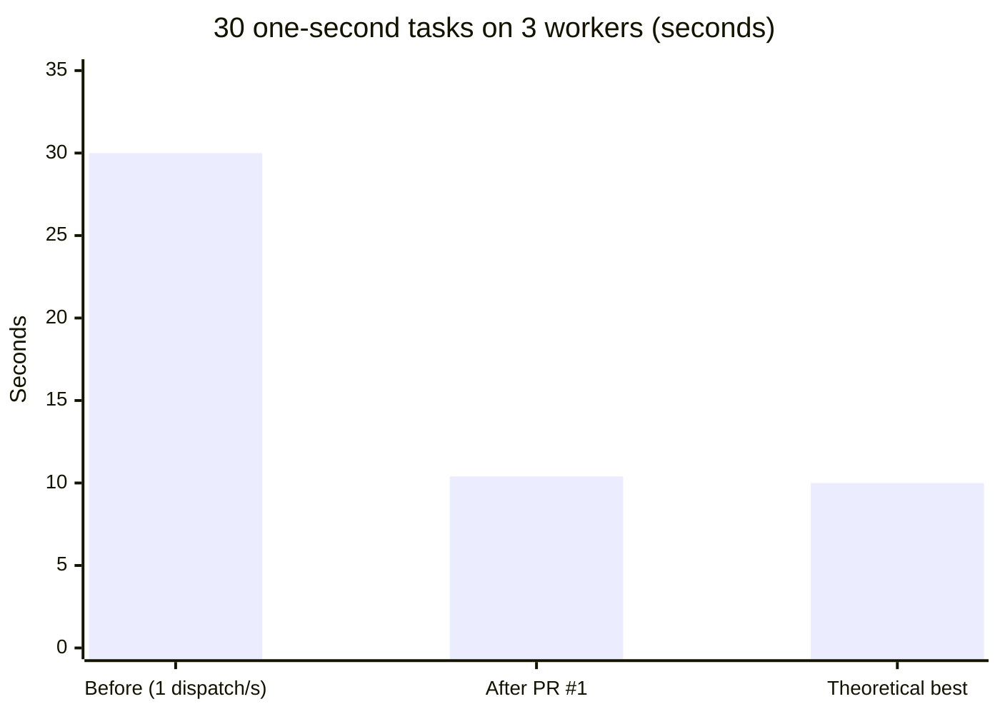
```mermaid
xychart-beta
    title "30 one-second tasks on 3 workers (seconds)"
    x-axis ["Before (1 dispatch/s)", "After PR #1", "Theoretical best"]
    y-axis "Seconds" 0 --> 35
    bar [30, 10.4, 10]
```

### Crash recovery, as verified by killing a worker

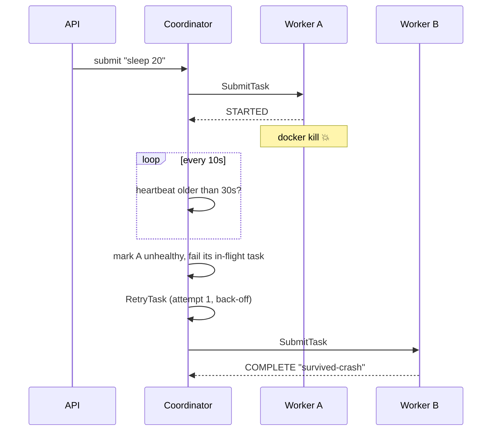
```mermaid
sequenceDiagram
    participant API
    participant C as Coordinator
    participant W1 as Worker A
    participant W2 as Worker B
    API->>C: submit "sleep 20"
    C->>W1: SubmitTask
    W1-->>C: STARTED
    Note over W1: docker kill 💥
    loop every 10s
        C->>C: heartbeat older than 30s?
    end
    C->>C: mark A unhealthy, fail its in-flight task
    C->>C: RetryTask (attempt 1, back-off)
    C->>W2: SubmitTask
    W2-->>C: COMPLETE "survived-crash"
```

---

## Phase 1: Production basics

**Goal:** every change is tested automatically, and the system is safe to put on a network.
**Result:** PR #2. Every Phase 1 item is done; see the scorecard at the end of this section.

### 1. One binary, clearer roles

The four Dockerfiles and three `main` packages became **one binary with subcommands**. The HTTP service was renamed `api` because it never scheduled anything, and the stale-task cleanup moved into the coordinator, which leaves the API completely stateless.

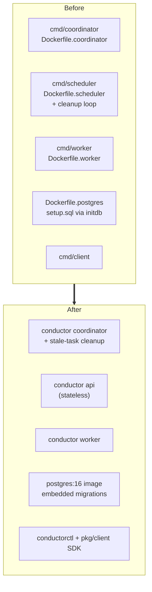
```mermaid
flowchart TB
    subgraph before [Before]
        direction LR
        b1["cmd/coordinator<br/>Dockerfile.coordinator"]
        b2["cmd/scheduler<br/>Dockerfile.scheduler<br/>+ cleanup loop"]
        b3["cmd/worker<br/>Dockerfile.worker"]
        b4["Dockerfile.postgres<br/>setup.sql via initdb"]
        b5["cmd/client"]
    end
    subgraph after [After]
        direction LR
        a1["conductor coordinator<br/>+ stale-task cleanup"]
        a2["conductor api<br/>(stateless)"]
        a3["conductor worker"]
        a4["postgres:16 image<br/>embedded migrations"]
        a5["conductorctl + pkg/client SDK"]
    end
    before ==> after
```

`pkg/app` owns each component's lifecycle (connect, migrate, serve, shut down), so `cmd/conductor/main.go` is tiny. That structure also makes Phase 2's single-process `dev` mode a few lines of code.

### 2. Schema migrations

`setup.sql` used to run once through Postgres' `initdb` hook, with no way to change the schema later. It is now an embedded, forward-only migration runner:


```mermaid
flowchart LR
    start([component starts]) --> lock["pg_advisory_lock<br/>(one migrator at a time)"]
    lock --> read[read schema_migrations]
    read --> loop{"next NNNN_*.sql<br/>not applied?"}
    loop -- yes --> tx["BEGIN · run file · record version · COMMIT"]
    tx --> loop
    loop -- no --> unlock[unlock] --> serve([serve])
```

- Migration `0001` is **idempotent** (`IF NOT EXISTS`, `DO $$ … duplicate_object`), so databases created by the old `setup.sql` upgrade in place. This was verified against the real volume from Phase 0.
- The coordinator and the API both migrate on startup; the advisory lock makes that safe. A test runs three migrators concurrently.

### 3. A transactional data layer

Every query takes a `context.Context`, and `db.WithTx` runs a function inside a transaction. Starting a workflow (create run, create steps, create the first task, link them) is now atomic, and Phase 2's DAG engine depends on this.

```go
err := s.db.WithTx(ctx, func(tx *db.DB) error {
    wf, _ := tx.CreateWorkflow(ctx, ...)
    // ...steps, first task, links: all or nothing
})
```

### 4. Security layers

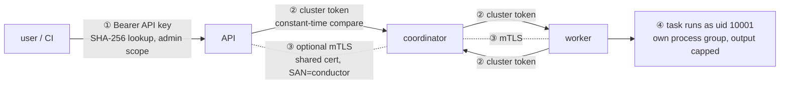
```mermaid
flowchart LR
    U[user / CI] -- "① Bearer API key<br/>SHA-256 lookup, admin scope" --> API
    API -- "② cluster token<br/>constant-time compare" --> CO[coordinator]
    CO -- "② cluster token" --> W[worker]
    W -- "② cluster token" --> CO
    API -. "③ optional mTLS<br/>shared cert, SAN=conductor" .- CO
    CO -. "③ mTLS" .- W
    W --> T["④ task runs as uid 10001<br/>own process group, output capped"]
```

| Layer | Detail |
|---|---|
| ① API keys | `cnd_` + 256 random bits. Only a SHA-256 hash is stored (keys are random, so a slow KDF adds nothing). Admin keys manage keys. `CONDUCTOR_API_KEY` bootstraps the first one. |
| ② Cluster token | Required on **every** gRPC call in both directions, checked by interceptors with a constant-time comparison. Before this, anyone who could reach port 8080 could register a fake worker and receive every task. |
| ③ mTLS | Optional. All components share one cluster certificate with SAN `conductor`; clients verify that name rather than the dialed IP, so dynamic worker IPs just work. `scripts/gen-dev-certs.sh` plus `docker-compose.tls.yml` turn it on. |
| ④ Execution | Non-root container user, 1 MB output cap (the head and tail are kept, since errors usually appear at the end), 1 MB request cap, unknown JSON fields rejected. |

### 5. Cancellation

Killing `sh` alone isn't enough: `sh -c "sleep 60; echo"` leaves `sleep` running and holding the output pipe open. Workers start each task in **its own process group** and kill the whole group.

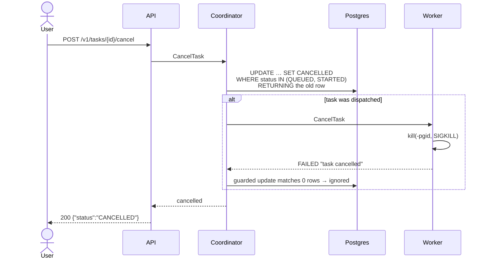
```mermaid
sequenceDiagram
    actor U as User
    participant A as API
    participant C as Coordinator
    participant DB as Postgres
    participant W as Worker
    U->>A: POST /v1/tasks/{id}/cancel
    A->>C: CancelTask
    C->>DB: UPDATE … SET CANCELLED<br/>WHERE status IN (QUEUED, STARTED)<br/>RETURNING the old row
    alt task was dispatched
        C->>W: CancelTask
        W->>W: kill(-pgid, SIGKILL)
        W-->>C: FAILED "task cancelled"
        C->>DB: guarded update matches 0 rows → ignored
    end
    C-->>A: cancelled
    A-->>U: 200 {"status":"CANCELLED"}
```

The guarded transitions from PR #1 (`WHERE status IN ('QUEUED','STARTED') AND picked_at IS NOT NULL`) are what make this safe: the killed process's failure report arrives *after* the cancel and changes nothing.

**Cancelling a workflow** sets `cancel_requested`, cancels the running step, and compensates the completed steps in reverse. The final status is `CANCELLED` rather than `FAILED`. If the running step finishes before the cancel lands, the completion handler sees the flag and compensates instead of starting the next step.

### 6. Graceful shutdown

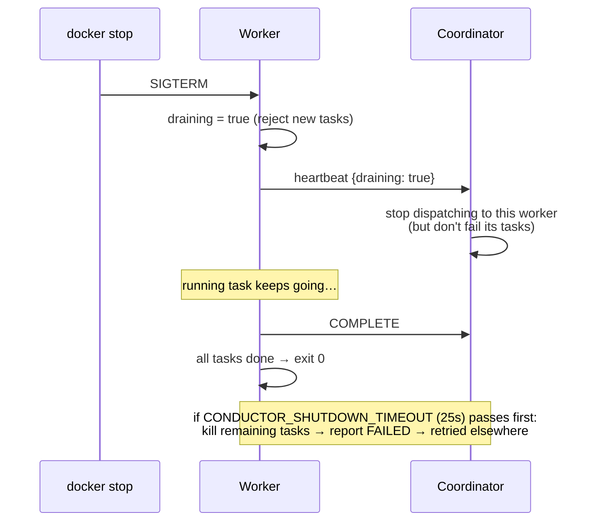
```mermaid
sequenceDiagram
    participant D as docker stop
    participant W as Worker
    participant C as Coordinator
    D->>W: SIGTERM
    W->>W: draining = true (reject new tasks)
    W->>C: heartbeat {draining: true}
    C->>C: stop dispatching to this worker<br/>(but don't fail its tasks)
    Note over W: running task keeps going…
    W->>C: COMPLETE
    W->>W: all tasks done → exit 0
    Note over W,C: if CONDUCTOR_SHUTDOWN_TIMEOUT (25s) passes first:<br/>kill remaining tasks → report FAILED → retried elsewhere
```

Compose gives workers `stop_grace_period: 30s`, a little longer than the drain timeout.

### 7. The task lifecycle, now complete

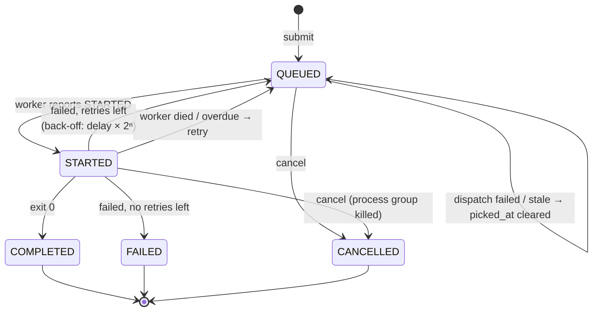
```mermaid
stateDiagram-v2
    [*] --> QUEUED: submit
    QUEUED --> QUEUED: picked (picked_at set)
    QUEUED --> STARTED: worker reports STARTED
    STARTED --> COMPLETED: exit 0
    STARTED --> QUEUED: failed, retries left<br/>(back-off: delay × 2ⁿ)
    QUEUED --> QUEUED: dispatch failed / stale → picked_at cleared
    STARTED --> FAILED: failed, no retries left
    STARTED --> QUEUED: worker died / overdue → retry
    QUEUED --> CANCELLED: cancel
    STARTED --> CANCELLED: cancel (process group killed)
    COMPLETED --> [*]
    FAILED --> [*]
    CANCELLED --> [*]
```

### 8. Testing: three layers, all automated

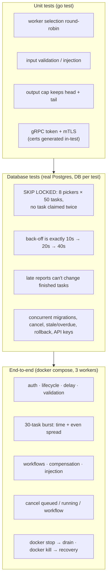
```mermaid
flowchart TB
    subgraph unit ["Unit tests (go test)"]
        u1[worker selection round-robin]
        u2[input validation / injection]
        u3[output cap keeps head + tail]
        u4["gRPC token + mTLS<br/>(certs generated in-test)"]
    end
    subgraph dbt ["Database tests (real Postgres, DB per test)"]
        d1["SKIP LOCKED: 8 pickers × 50 tasks,<br/>no task claimed twice"]
        d2["back-off is exactly 10s → 20s → 40s"]
        d3[late reports can't change finished tasks]
        d4[concurrent migrations, cancel, stale/overdue, rollback, API keys]
    end
    subgraph e2e ["End-to-end (docker compose, 3 workers)"]
        e1[auth · lifecycle · delay · validation]
        e2[30-task burst: time + even spread]
        e3[workflows · compensation · injection]
        e4[cancel queued / running / workflow]
        e5["docker stop → drain · docker kill → recovery"]
    end
    unit --> dbt --> e2e
```

The e2e suite automates every check from Phase 0's manual verification. It finds the container running a task with `docker top`, so it can stop or kill precisely that worker.

### 9. CI pipeline


```mermaid
flowchart LR
    PR([push / PR]) --> L[lint<br/>golangci-lint v2]
    PR --> T["unit + DB tests<br/>-race, Postgres service"]
    PR --> E1["e2e · plaintext"]
    PR --> E2["e2e · mTLS<br/>certs generated in CI"]
    L & T & E1 & E2 --> G{all green?}
    G -- yes --> M([merge])
```

Running the e2e suite **over mTLS as well** matters: the secure configuration is the one most likely to break unnoticed, because developers rarely run it locally.

### 10. Results

Local run (Windows host, Docker Desktop, 3 workers):

| Suite | Result |
|---|---|
| Unit | ✅ coordinator, workflow, worker, security |
| Database (real Postgres) | ✅ 10 tests |
| E2E, plaintext | ✅ 14/14 in 102s (burst: 10.6s, split 10/10/10) |
| E2E, mutual TLS | ✅ 14/14 in 104s |
| golangci-lint | ✅ 0 issues |

### Design decisions

| Decision | Alternatives | Why |
|---|---|---|
| Hand-written migration runner (~100 lines) | golang-migrate | No new dependency, embedded in the binary, advisory-locked. Fits "Postgres is the only dependency". |
| DB tests use `CONDUCTOR_TEST_DATABASE_URL` | testcontainers-go | CI already has a Postgres service; avoids a heavy Docker-client dependency tree. |
| One shared cluster certificate | Per-component certs | Workers have dynamic IPs; verifying a fixed SAN keeps mTLS working without a cert per replica. |
| Cancel endpoint is `POST …/cancel` | `DELETE /tasks/{id}` | Cancelling doesn't delete anything; the task stays queryable. |
| Single binary pulled forward from Phase 2 | Keep 3 binaries | Every `main` was being rewritten anyway. |
| Shell tasks run as non-root | Root (old behaviour) | Least privilege; tasks needing root should use the container executor (Phase 2). |

### Phase 1 scorecard

| Item | Status |
|---|---|
| 1.1 Line endings, gofmt, lint config, Makefile, LICENSE (Apache-2.0) | ✅ |
| 1.2 CI, automated e2e, DB tests, (branch protection needs a repo admin) | ✅ / ⚠️ |
| 1.3 Migrations, config, slog, graceful shutdown | ✅ |
| 1.4 API keys, cluster token, mTLS, `.dockerignore`, `.env.example`, limits, `/v1` | ✅ |
| 1.5 Task and workflow cancellation | ✅ |

---

## Phase 2: A real scheduler

**Goal:** users define their own workflows without editing Go code, and tasks go beyond shell commands.
**Result:** PR #3. Every Phase 2 item is done: 64 files and about 8,000 lines, with 29 end-to-end tests, all green over plaintext and mTLS.

### 1. What a user can do now that they couldn't before

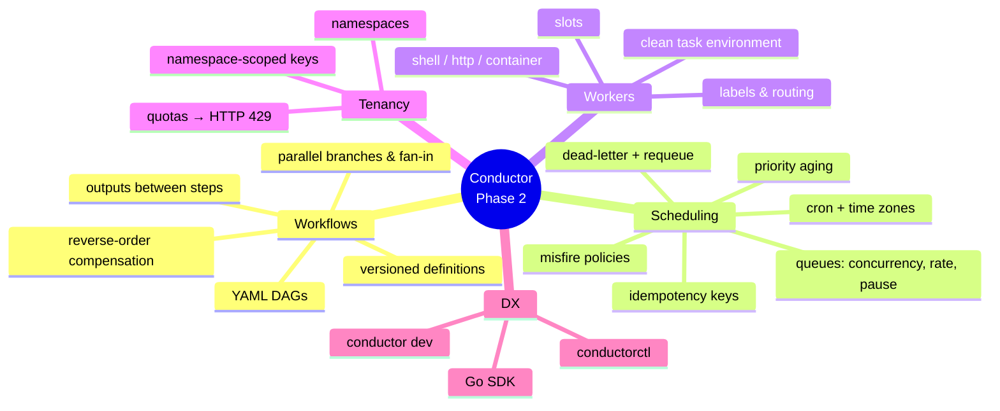
```mermaid
mindmap
  root((Conductor<br/>Phase 2))
    Workflows
      YAML DAGs
      parallel branches & fan-in
      outputs between steps
      versioned definitions
      reverse-order compensation
    Scheduling
      cron + time zones
      misfire policies
      queues: concurrency, rate, pause
      priority aging
      idempotency keys
      dead-letter + requeue
    Workers
      slots
      labels & routing
      shell / http / container
      clean task environment
    Tenancy
      namespaces
      quotas → HTTP 429
      namespace-scoped keys
    DX
      conductor dev
      conductorctl
      Go SDK
```

### 2. Workflows became data, and DAGs

Phase 1's workflows were Go structs compiled into the binary, and they ran strictly one step after another. Now they are YAML documents uploaded through the API, stored as versions, and executed as a **DAG**:

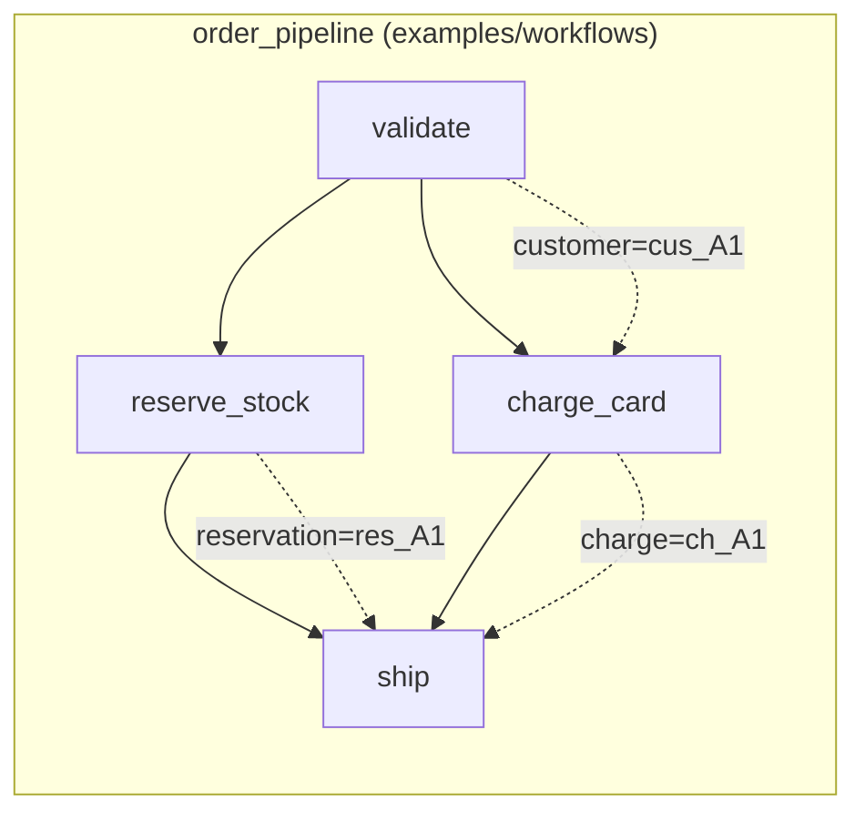
```mermaid
flowchart LR
    subgraph def ["order_pipeline (examples/workflows)"]
        V[validate] --> R[reserve_stock]
        V --> C[charge_card]
        R --> S[ship]
        C --> S
    end
    V -. "customer=cus_A1" .-> C
    R -. "reservation=res_A1" .-> S
    C -. "charge=ch_A1" .-> S
```

The dotted edges are **outputs**: a step appends `key=value` lines to `$CONDUCTOR_OUTPUT`, and later steps read them with `${{ steps.validate.outputs.customer }}` in their `env`. Validation guarantees a step can only reference outputs of steps it (transitively) depends on, so a reference can never point at a step that hasn't run.

Here is an actual run from the e2e suite. The two branches started **2.4 ms apart**:


```mermaid
gantt
    title order_pipeline run (e2e)
    dateFormat HH:mm:ss
    axisFormat %S s
    section start
    validate      :done, 00:00:00, 00:00:01
    section parallel
    reserve_stock :done, 00:00:01, 00:00:03
    charge_card   :done, 00:00:01, 00:00:03
    section fan-in
    ship          :done, 00:00:03, 00:00:04
```

### 3. The engine is a pure function

The most important design decision of Phase 2: **the workflow engine contains no I/O.** `workflow.Reconcile(definition, state) → plan` takes a snapshot of every step's status and returns what should happen next. The coordinator applies the plan.

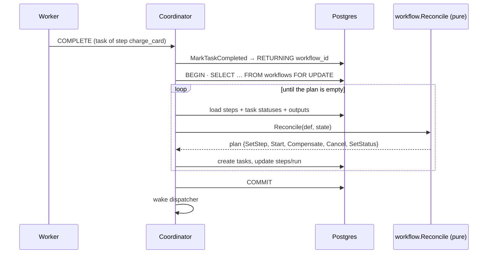
```mermaid
sequenceDiagram
    participant W as Worker
    participant C as Coordinator
    participant DB as Postgres
    participant R as workflow.Reconcile (pure)
    W->>C: COMPLETE (task of step charge_card)
    C->>DB: MarkTaskCompleted → RETURNING workflow_id
    C->>DB: BEGIN · SELECT … FROM workflows FOR UPDATE
    loop until the plan is empty
        C->>DB: load steps + task statuses + outputs
        C->>R: Reconcile(def, state)
        R-->>C: plan {SetStep, Start, Compensate, Cancel, SetStatus}
        C->>DB: create tasks, update steps/run
    end
    C->>DB: COMMIT
    C->>C: wake dispatcher
```

Why it matters:

| Property | How it's achieved |
|---|---|
| **No races between parallel branches** | `reserve_stock` and `charge_card` can finish at the same moment. Each reconcile holds `FOR UPDATE` on the run, so the second one sees the first one's result and `ship` starts exactly once. |
| **Crash-safe** | A plan is applied in one transaction. If the coordinator dies mid-way, nothing is half-applied, and a sweep re-reconciles every active run every 15 seconds. |
| **Idempotent** | Reconciling the same state twice yields the same plan, so extra reconciles are harmless. |
| **Testable without a database** | `dag_test.go` drives the reconciler with a tiny simulator that plays the coordinator's role and records events per round. Parallelism and compensation order are asserted exactly. |
| **HA-ready** | Every decision is derived from rows in Postgres, not memory. That's what Phase 3's multiple coordinators will need. |

### 4. Step and run lifecycles

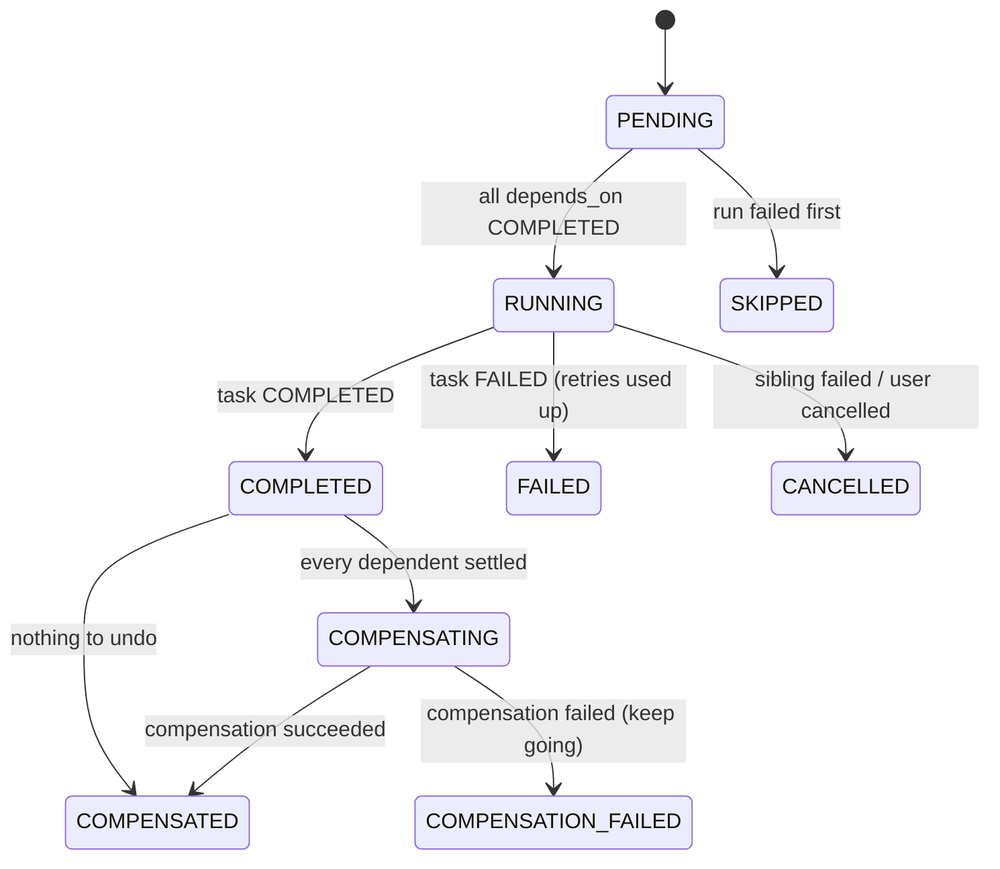
```mermaid
stateDiagram-v2
    [*] --> PENDING
    PENDING --> RUNNING: all depends_on COMPLETED
    PENDING --> SKIPPED: run failed first
    RUNNING --> COMPLETED: task COMPLETED
    RUNNING --> FAILED: task FAILED (retries used up)
    RUNNING --> CANCELLED: sibling failed / user cancelled
    COMPLETED --> COMPENSATING: every dependent settled
    COMPLETED --> COMPENSATED: nothing to undo
    COMPENSATING --> COMPENSATED: compensation succeeded
    COMPENSATING --> COMPENSATION_FAILED: compensation failed (keep going)
```

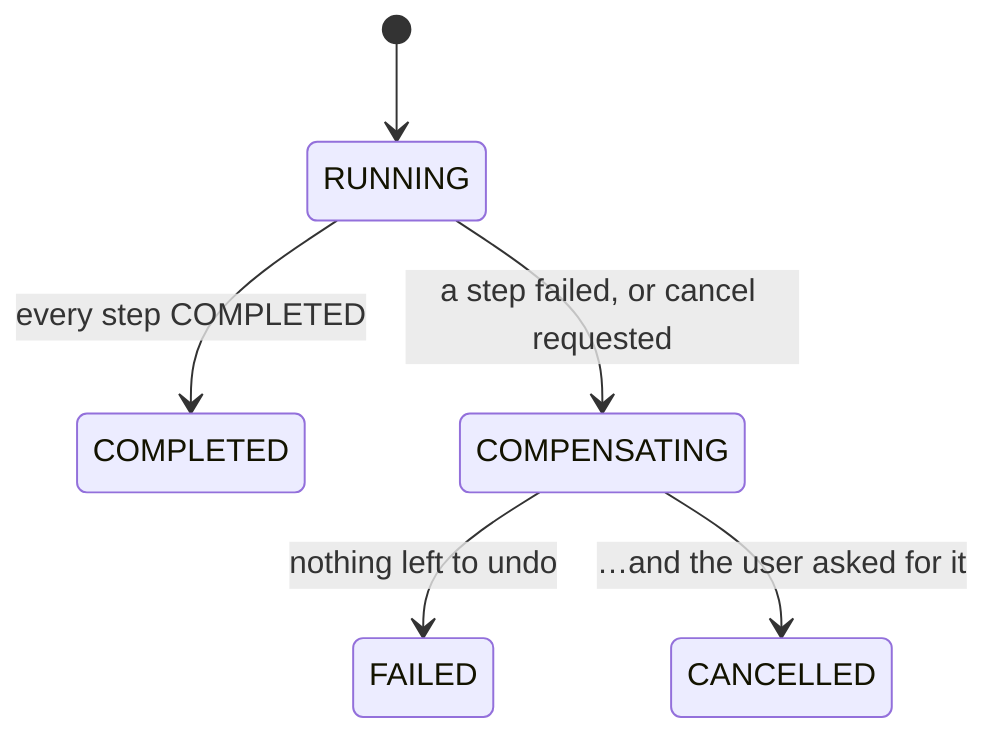
```mermaid
stateDiagram-v2
    [*] --> RUNNING
    RUNNING --> COMPLETED: every step COMPLETED
    RUNNING --> COMPENSATING: a step failed, or cancel requested
    COMPENSATING --> FAILED: nothing left to undo
    COMPENSATING --> CANCELLED: …and the user asked for it
```

**Compensation order** is reverse *dependency* order, not reverse start order. A completed step is undone only once everything that depends on it has been undone (or never ran). In the failing `order_pipeline`, `ship` fails, both parallel branches are refunded and released **in parallel**, and then `validate`:

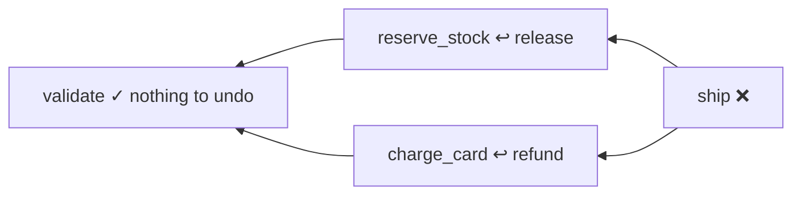
```mermaid
flowchart RL
    S["ship ❌"] --> R["reserve_stock ↩ release"]
    S --> C["charge_card ↩ refund"]
    R --> V["validate ✓ nothing to undo"]
    C --> V
```

### 5. Shell injection: fixed at the root

PR #1 *filtered* dangerous characters out of workflow inputs. Phase 2 removes the attack surface entirely:

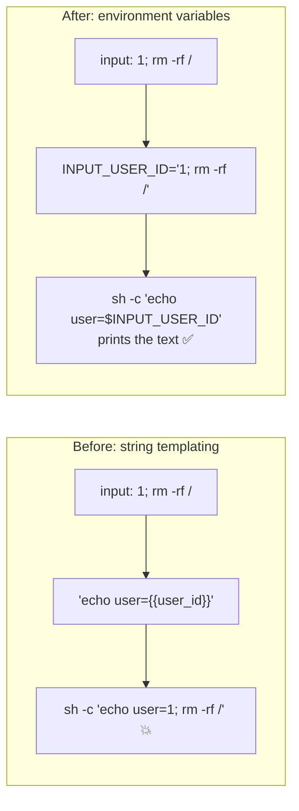
```mermaid
flowchart LR
    subgraph before ["Before: string templating"]
        i1["input: 1; rm -rf /"] --> t1["'echo user={{user_id}}'"] --> sh1["sh -c 'echo user=1; rm -rf /' 💥"]
    end
    subgraph after ["After: environment variables"]
        i2["input: 1; rm -rf /"] --> e2["INPUT_USER_ID='1; rm -rf /'"] --> sh2["sh -c 'echo user=$INPUT_USER_ID'<br/>prints the text ✅"]
    end
```

The definition validator also **rejects `${{ }}` inside `run:`**, with an error explaining to use `env:`, so nobody can reintroduce templating by accident. The e2e test submits `1; touch /tmp/pwned-… #` and checks that every worker's `/tmp` is clean.

### 6. 🔐 Security finding: tasks could read the cluster token

While building the environment-variable plumbing, I noticed that since Phase 1, shell tasks had inherited the **worker's whole environment**, and the worker's environment contains `CONDUCTOR_CLUSTER_TOKEN`:

```mermaid
sequenceDiagram
    actor A as Any API user
    participant W as Worker
    participant C as Coordinator
    A->>W: task "echo $CONDUCTOR_CLUSTER_TOKEN"
    W-->>A: output: the token 😱
    A->>C: SendHeartbeat as a fake worker (valid token)
    C->>A: dispatches other tenants' tasks to the attacker
```

**Fix:** tasks get a minimal environment (`PATH`, `HOME`, `LANG`, `TMPDIR`, plus the task's own `CONDUCTOR_*` variables). Anything else must be allow-listed with `CONDUCTOR_WORKER_PASS_ENV`. Compose also stopped giving workers database credentials and the API key at all. A unit test and an e2e test both assert the token is absent.

### 7. Smarter dispatch in one SQL statement

Every scheduling rule is enforced inside the `SKIP LOCKED` pick query, so there are no in-memory counters that could drift or disagree between coordinators:

```mermaid
flowchart TB
    Q([QUEUED, not picked, due]) --> P{queue paused?}
    P -- yes --> X[skip]
    P -- no --> L{"some free worker has<br/>all required labels?<br/>(jsonb @>)"}
    L -- no --> X
    L -- yes --> CC{"queue running #lt; concurrency_limit?"}
    CC -- no --> X
    CC -- yes --> RL{"dispatches in last period #lt; rate_limit?"}
    RL -- no --> X
    RL -- yes --> NS{"namespace running #lt; max_concurrency?"}
    NS -- no --> X
    NS -- yes --> O["ORDER BY priority − aging, scheduled_at<br/>LIMIT 1 FOR UPDATE SKIP LOCKED"]
    O --> D([dispatch to a round-robin pick<br/>among matching free workers])
```

- **Labels:** workers advertise `type.shell`, `type.http`, `type.container` (if Docker answers) plus user labels. Each task requires `type.<its type>` plus its own labels. A GPU task waits for a GPU worker; nobody else takes it.
- **Slots:** each worker runs `CONDUCTOR_WORKER_SLOTS` tasks at once (default 2). The burst test: **40 one-second tasks on 8 slots in 5.7s** (ideal 5s), split 10/10/10/10.
- **Priority aging:** effective priority improves by one level per `CONDUCTOR_PRIORITY_AGING` waited, so a priority-9 task can't starve behind a stream of priority-1s.
- **Rate limits** use a sliding window over `last_dispatched_at`, so there's no token-bucket state to keep consistent.

### 8. Three task types

```mermaid
flowchart LR
    T[task] --> S{type}
    S -- shell --> SH["sh -c in its own process group<br/>clean env, $CONDUCTOR_OUTPUT"]
    S -- http --> HT["HTTP request<br/>outputs: status, body<br/>expect_status"]
    S -- container --> CT["Docker Engine API over the socket<br/>pull → create → start → wait → logs → remove<br/>memory / cpus / network:none"]
```

The container executor talks to Docker's HTTP API directly over the Unix socket in about 300 lines, with no Docker SDK and its large dependency tree. It demultiplexes Docker's 8-byte-header log frames, kills the container on cancel or timeout, and always removes it. Because socket access is root-equivalent, it runs only in the opt-in `container-worker` service.

### 9. Cron schedules

```mermaid
timeline
    title Coordinator down 10.05 to 13.20, hourly schedule
    10.00 : fired normally
    11.00 : missed
    12.00 : missed
    13.00 : missed
    13.20 back up : skip → next run 14.00 : run_once → fire now, then 14.00 : catch_up → fire 11.00, 12.00, 13.00, one per tick
```

- Firing a run and advancing `next_run_at` happen in **one transaction**, with `FOR UPDATE SKIP LOCKED` on due schedules. Each run uses the idempotency key `schedule:<id>:<run unix time>`, so a run time can never fire twice, even with several coordinators.
- Time zones come from Go's embedded tz database (`time/tzdata`), so `Asia/Kolkata` works even in a minimal container.
- `@every 30s` and `@hourly` descriptors work alongside 5-field cron.

### 10. Data model after Phase 2

```mermaid
erDiagram
    namespaces ||--o{ api_keys : "binds"
    namespaces ||--o{ tasks : "owns"
    namespaces ||--o{ queues : "limits"
    namespaces ||--o{ workflow_definitions : "versions"
    namespaces ||--o{ workflows : "runs"
    namespaces ||--o{ schedules : "fires"
    workflows ||--|{ workflow_steps : "has"
    workflow_steps |o--o| tasks : "task / compensation"
    workflows ||--o{ tasks : "workflow_id"
    tasks {
        uuid id
        text namespace
        text queue
        text type
        jsonb spec
        jsonb env
        jsonb requirements
        jsonb outputs
        text idempotency_key
    }
    workflows {
        uuid id
        jsonb definition "snapshot"
        int definition_version
        bool cancel_requested
    }
    schedules {
        text cron
        text timezone
        text misfire_policy
        jsonb target
        timestamptz next_run_at
    }
    workers {
        bigint id
        jsonb labels
        int slots
        text status
    }
```

### 11. Bugs found along the way

| Bug | How it was found | Fix |
|---|---|---|
| Tasks could read `CONDUCTOR_CLUSTER_TOKEN` | Code review while adding task env vars | Minimal task env + allow-list; e2e test |
| Times passed in a non-UTC zone were stored hours off (columns are `TIMESTAMP` without a zone) | The priority-aging DB test failed on an IST machine | Normalize to UTC on insert; pin the session to `timezone=UTC` |
| Retried tasks lost the failed attempt's output | Debugging a failing container task | `RetryTask` keeps the output |
| SDK sent `created_at` when creating a namespace; strict JSON decoding rejected it | Manual CLI smoke test | Send an explicit request body |
| The Docker image failed to build once `examples/` was embedded | `docker compose up --build` | `COPY examples` in the Dockerfile |

### 12. Results

| Suite | Count | Result |
|---|---|---|
| Unit (workflow, schedule, worker, coordinator, security, examples) | 35 tests + 11 validation subtests | ✅ |
| Database (real Postgres) | 18 | ✅ |
| E2E, plaintext (3 workers + container worker) | 29 | ✅ 143s |
| E2E, mutual TLS | 29 | ✅ 155s |
| golangci-lint | | ✅ 0 issues |

```mermaid
pie title Tests by layer
    "Unit" : 35
    "Database" : 18
    "End-to-end" : 29
```

### Design decisions

| Decision | Alternatives | Why |
|---|---|---|
| Pure reconciler + row lock | Event handlers per transition (Phase 1 style) | Parallel branches made event handlers race-prone; a pure function is testable and HA-friendly. |
| Inputs only via env vars | Shell-quoting values | Quoting is shell-specific and easy to get wrong; env vars are not parsed as code. |
| Definition snapshot per run | Reference by version | Runs stay readable and deterministic even if versions are deleted later. |
| All dispatch rules in SQL | In-memory counters | One source of truth; correct with several coordinators (Phase 3). |
| Raw Docker Engine API | Docker Go SDK | ~300 lines instead of dozens of transitive dependencies. |
| GitHub-Actions-style `${{ }}` and `$CONDUCTOR_OUTPUT` | A new syntax | Familiar to most developers. |
| `api` doesn't run cron | Cron in the API | Firing must be single-writer per run, which belongs with the coordinator (and its future leader election). |

### Phase 2 scorecard

| Item | Status |
|---|---|
| 2.1 Workflows as data: YAML, versions, DAGs, outputs, env-only inputs, per-step options, validation | ✅ |
| 2.2 Cron + misfire, idempotency keys, priority aging, queues (concurrency/rate/pause), dead letter | ✅ |
| 2.3 Worker slots and labels, requirement matching, worker registry | ✅ |
| 2.4 Executors: shell, http, container | ✅ |
| 2.5 `conductor dev`, `conductorctl`, Go SDK | ✅ |
| 2.6 Namespaces with quotas | ✅ |

**Exit criterion:** *"a new user can write a YAML DAG workflow with parallel steps, schedule it with cron, and watch it run with conductorctl, without touching Go code."*

```bash
conductorctl workflow apply -f my_dag.yaml
conductorctl schedule create nightly -cron '0 2 * * *' -workflow my_dag
conductorctl workflow watch <id>
```

✅ Met, and covered by the e2e suite.

---

## Phase 3: Distributed-systems depth

**Done (PR #4):** coordinator high availability with epoch fencing and attempt IDs, a hot path that drains ~980 no-op tasks/s where it managed ~400 on the same 50 slots, published benchmarks at 1, 10 and 50 workers, a nightly chaos suite with invariant checks, and the push-vs-pull design record.

### Leader election and failover

```mermaid
sequenceDiagram
    participant A as Coordinator A (leader)
    participant B as Coordinator B (standby)
    participant PG as Postgres
    participant W as Worker
    A->>PG: holds advisory lock · epoch 9
    B->>PG: pg_try_advisory_lock → false (every 1s)
    W->>B: UpdateTaskStatus
    B-->>W: not the leader, leader=A
    W->>A: UpdateTaskStatus ✓
    Note over A: docker kill 💥
    PG->>PG: A's session ends → lock released
    B->>PG: pg_try_advisory_lock → true
    B->>PG: BumpEpoch → 10 (waits for A's in-flight fenced writes)
    B->>PG: rebuild workers + running tasks
    W->>A: report ✗ (no answer within 3s)
    W->>B: report ✓
```

- **Election:** a session-scoped Postgres advisory lock. When the leader dies, Postgres releases it. In the e2e test a standby takes over **500 ms–1 s** after the kill, with no task or workflow lost.
- **Fencing:** every leader write first checks the epoch under a share lock on the leader row. The new leader's epoch bump must wait for those locks, so a deposed leader's writes fail with `ErrFenced` once its successor is in charge. A DB test proves the bump waits for an in-flight fenced write.
- **Attempt IDs:** each dispatch increments `tasks.attempt`, and reports must quote it. The partition e2e test cuts a worker off mid-task, waits for the retry (attempt 2), heals the partition, and checks that attempt 1's late report is ignored.
- **Failover client** (`pkg/coordclient`): follows "not the leader" redirects and retries through elections.

### Bugs found by the failover test

| Bug | Symptom | Fix |
|---|---|---|
| Calls aimed at the dead leader waited for gRPC's **20 s** connect timeout (a killed container's IP never answers) | Task results arrived about 20 s late after a failover | 3 s per-attempt timeout and a 2 s connect timeout: lag ≤ 2 s |
| Forgetting a dead leader **closed a connection another call was using** | A result report failed with `Canceled` and was never retried; the task stayed `STARTED` | Keep connections and treat caller-independent cancellation as retryable |

### Making the hot path fast

The first benchmark said throughput was flat at about 230 tasks/s whatever
the number of workers, and I blamed round trips. That was only partly right,
and the way to find out was to stop guessing and measure Postgres directly:
`pg_stat_statements`, wait events sampled from `pg_stat_activity` during a
run, and the Go connection pool's own statistics. Each pass found one limit.

```mermaid
flowchart TB
    subgraph before [Per task, before]
        direction LR
        A1[API insert<br/>+ NOTIFY 🔒] --> A2[claim<br/>4 round trips] --> A3[send to worker] --> A4[worker → STARTED<br/>4 round trips] --> A5[run] --> A6[COMPLETE<br/>4 round trips]
    end
    subgraph after [Per task, after]
        direction LR
        B1[API insert<br/>no NOTIFY] --> B2[batch claim<br/>1 statement] --> B3[send, async] --> B5[run] --> B6[COMPLETE<br/>1 statement]
        B3 -.-> B4[STARTED<br/>off the slot's path]
    end
    before ~~~ after
```

| # | What the measurement showed | Fix |
|---|---|---|
| 1 | Inserts waiting on the wait event `Lock: object`. That is the `NOTIFY` queue lock, which Postgres holds from a notifying commit until its WAL flush, so **notifying commits run one at a time** | The leader wakes its own dispatcher. Its sessions set `conductor.local_wake=on` and the triggers skip `NOTIFY` for them (migration 0006). Other writers still notify |
| 2 | Postgres at **~510% CPU** (my earlier "8%" was sampled while idle) and backend PIDs climbing fast | The pool kept 10 idle connections out of 20, so every load spike forked new backends with cold caches. Keep all 20 |
| 3 | 15,026 pool waits in a 10 s run, 189 s waited in total | Each STARTED/COMPLETE report held a connection for a 4-round-trip fenced transaction. The fence now sits inside the statement: `AND EXISTS (SELECT 1 FROM coordinator_leader WHERE epoch = $n FOR SHARE)`. That is the same share lock, so the same guarantee (two new DB tests), in one round trip |
| 4 | About 65 requeues per run | **Slot race:** workers freed a slot only after their result report returned, but the coordinator counted it free on arrival and sent the next task straight away, which the worker refused. Workers now free the slot first |
| 5 | Steady-load latency far above drain capacity would predict | Workers sent a **blocking STARTED report** before every task. The coordinator now records the start itself when the worker accepts |
| 6 | "Throughput" could never exceed the submit rate | **The benchmark was wrong**: it timed submission and dispatch together. It now measures ingest, drain (a paused queue, resumed) and latency at fixed rates separately |

Results on the same laptop: drain went from ~400 to **~980 tasks/s** (50
slots), and dispatch p50 under steady load from **1,607 ms to 96 ms**. Full
numbers at 1, 10 and 50 workers are in [BENCHMARKS.md](BENCHMARKS.md).

Two experiments didn't pay off and were reverted. Fencing only "belief-driven"
writes made no difference, so the simple rule that every leader write is
fenced stayed. A 64-connection pool removed the waits without adding
throughput, and three processes × 64 would exceed Postgres's default
100-connection limit anyway.

### A bug the benchmark caught

At 10 workers, a few workflows took **17 s** instead of 1 s. The step timings
showed the fan-in step being created about 15 s late. The coordinator log
explained it:

```
failed to mark task completed: pq: value "2937479422" is out of range for type integer
```

My new back-fill `worker_id = COALESCE(NULLIF($5, 0), worker_id)` let
Postgres infer `$5` as a 32-bit integer from the literal `0`. Worker IDs use
the full uint32 range. The report failed, and only the worker's retry got
through, by luck: the slot had already been released, so the retry sent
worker ID 0. Fixed with `$5::bigint` and a test with a large worker ID. The
unit tests had used ID 0 and the e2e suite's workers happened to have small
IDs, so only the benchmark exposed it. Workflow p99 at 10 workers: 17 s →
1.9 s.

### Push or pull?

The plan asked whether workers should pull work instead of being pushed it.
[ADR 0001](docs/adr/0001-dispatch-push-vs-pull.md) records the answer, using
the profiling above. Every limit was in Postgres and the database work per
task is the same either way, so pull wouldn't make tasks cheaper. Letting
workers claim straight from Postgres would also hand database credentials to
the machines that run untrusted code. Scheduling stays in the leader. What
does change, in Phase 6, is the transport: workers will open the connection
(a gRPC stream), so they work behind NAT and need no address the coordinator
can dial.

### Chaos testing

```mermaid
timeline
    title One chaos run, with tasks and sagas submitted throughout
    kill a worker : 10 s down
    kill the leader : standby takes over
    Postgres latency : 150 ± 100 ms for 15 s (Toxiproxy)
    partition a worker : 25 s off the network
    cut Postgres : 8 s, coordinators and API
    restart Postgres
    kill both coordinators : 5 s with no coordinator at all
```

`TestChaos` (`make chaos`, nightly in CI) runs a steady workload the whole
time: a task every 200 ms (0.2–3 s of work, up to 10 retries) and a saga
every 800 ms. A saga is a four-step diamond where every step has a
compensation; one in four uses a definition whose last step always fails.
Submissions retry through outages with idempotency keys. Toxiproxy sits
between Postgres and the coordinators and API (`docker-compose.chaos.yml`).

Afterwards it checks:
- **No task lost:** every accepted task can still be read.
- **None stuck:** every task and workflow reached a terminal state.
- **Every task completed.** Retries must absorb every fault.
- **Compensation exactly where required:** each failing saga is `FAILED` with
  its three earlier steps `COMPENSATED` and their undo tasks completed; each
  succeeding saga is `COMPLETED` and never compensated.

**Results:** both local runs pass. Each submitted 708 tasks and 177 sagas;
50–54 submissions had to retry through an outage, and 6–8 tasks were
dispatched more than once because they lost their worker. Every task
completed, and every saga ended exactly as its definition requires.

**What the first run found.** It passed, but the logs showed the leader
**stepping down during the latency fault**, when Postgres was slow but
nowhere near gone:

| Fault | Leadership changes (first run) | After the fix |
|---|---|---|
| kill the leader | ✔ expected | ✔ |
| Postgres latency 150 ± 100 ms | ✘ leader stepped down | none |
| cut Postgres for 8 s | ✔ expected (both coordinators campaign until it returns) | ✔ |
| restart Postgres | ✔ expected | ✔ |
| kill both coordinators | ✔ expected | ✔ |

The heartbeat was an `UPDATE` of the `coordinator_leader` row, the row every
fenced write share-locks. It had to wait for all of them, and every fenced
write arriving meanwhile queued behind it. Under latency those locks are held
longer, the heartbeat hit its 2 s timeout, and the watchdog treated that as
a lost session. The same contention showed in the earlier profile, where the
heartbeat's mean time was 28 ms, a hot-path stall once a second. Two fixes:

- The heartbeat moved to its own table, `leader_heartbeat` (migration 0007),
  tagged with its epoch so a deposed leader's late heartbeat counts for
  nothing. A DB test checks that it no longer waits behind a fenced write.
- Only the session ping decides leadership, and it gets 5 s. A slow database
  is not a lost lock, and fencing covers the gap if it really is lost.

### Phase 3 scorecard

| Exit criterion | Result |
|---|---|
| Killing the leader mid-workflow loses or strands no work | ✅ e2e `TestLeaderFailover`, and the chaos suite |
| Chaos tests pass nightly | ✅ `chaos.yml`, run locally before merging |
| Benchmark numbers are published | ✅ [BENCHMARKS.md](BENCHMARKS.md) |

---

## Phase 4: Observability and UI

**Done (PR #5):** Prometheus metrics with Grafana and alert rules, OpenTelemetry tracing that follows a task through the queue and into user code, live task output and attempt history, and a web dashboard whose workflow page answers "which step failed, why, and what was undone" at a glance.

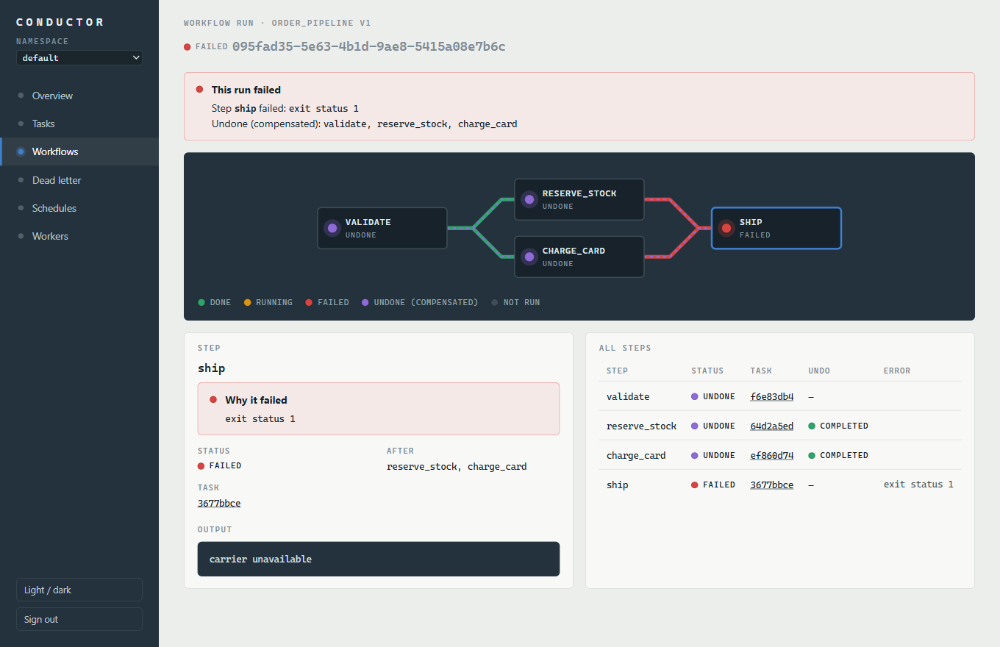

### Metrics

Every process serves `/metrics` on `:9090`. Counters and histograms are updated on paths that already do the work; anything describing state is computed when Prometheus scrapes, so it costs nothing in between:

| From | Metrics |
|---|---|
| Coordinator (counted as it works) | dispatches, results by outcome (`completed`, `failed`, `retried`, `stale`), lost tasks, dispatch failures, dispatch-latency and turnaround histograms, workflow outcomes, compensations, schedule runs, elections |
| Coordinator (at scrape, leader only) | leadership and epoch, workers by state, slots total and busy, per-queue tasks `ready` / `delayed` / `paused` / `running`, oldest due task's age |
| Worker | run time by type and outcome, slots, running tasks, undeliverable results |
| API | requests and latency by **route pattern** (a bounded label, unlike the path) |

`docker compose --profile observability up` adds Prometheus (which finds every replica through Compose DNS), Grafana with a provisioned 21-panel dashboard, and alert rules: no leader, no healthy workers, a queue backing up, a failure-rate spike, lost tasks.

**The first alert to fire was real.** On its first run, `ConductorQueueBackingUp` went pending: 2,000 tasks left over from an earlier experiment required a label no worker had, and had waited 9.5 hours. That exposed a gap too: a deliberately paused queue would have paged someone, so paused queues now report their tasks as `paused`, not `ready`.

### Tracing across the queue

A trace normally follows RPCs, but a task's life has a gap no RPC spans: it waits in Postgres between being submitted and being dispatched. The submitter's W3C `traceparent` is stored on the task row (migration 0008), so the trace survives the wait:

```mermaid
sequenceDiagram
    participant U as Client
    participant A as API
    participant C as Coordinator
    participant PG as Postgres
    participant W as Worker
    participant T as Task (user code)
    U->>A: POST /v1/tasks  (span: POST /v1/tasks)
    A->>C: SubmitTask  (gRPC carries the trace)
    C->>PG: INSERT … trace_parent = 00-4bf9…
    Note over PG: the task waits, maybe for hours
    C->>PG: claim a batch
    C->>C: span "dispatch", continuing 00-4bf9…
    C->>W: SubmitTask  (gRPC carries the trace)
    W->>T: span "run shell", TRACEPARENT=00-4bf9…
    W->>C: UpdateTaskStatus  (same trace)
```

Workflow steps and their compensations join their run's trace, so a failed saga is one trace. In testing, `order_pipeline` with a failing shipment came out as one trace of **42 spans** across the API, the coordinator and the workers. Tracing is off unless `OTEL_EXPORTER_OTLP_ENDPOINT` is set.

**Bug found:** API spans were all named `http`. otelhttp renames its span *after* the handler returns, overwriting the route name set inside it. A unit test with a span recorder passed, because the unmatched test route skipped that rename. The route now comes from a span-name formatter, and the e2e test checks a real trace in Jaeger.

### Live output, without paying for it

The plan said workers would stream output chunks to Postgres. Phase 3 had just shown that **Postgres writes are the throughput limit**, and that would add writes to every task whether or not anyone watched. So the output is read on demand instead:

```mermaid
flowchart LR
    B["Browser or<br/>conductorctl task logs -f"] -- "GET /v1/tasks/ID/logs?follow=true" --> API
    API -- "running? GetTaskOutput(attempt, offset)" --> C["Leader"]
    C -- "proxied to the worker running it" --> W["Worker<br/>(output buffer)"]
    API -- "finished? stored output" --> PG[("Postgres")]
```

While a task runs, the API polls the leader, which asks the worker for the output after an offset. When the attempt ends, the rest comes from the stored output; a retry starts a new section headed `--- attempt 2 ---`. Nothing happens unless someone is watching. A new `task_attempts` table keeps each failed attempt's worker, timing, error and output when the task is retried or requeued. It's written in the same statement as the retry, so only failure paths pay for it.

### The dashboard

Served at `/ui` from the binary. [ADR 0002](docs/adr/0002-dashboard-stack.md) records the stack: plain JavaScript modules on the JSON API, with no framework and no build step. That means one interface with exactly the API's permissions, and no CSRF surface, since the key travels as a Bearer header. The page holds an API key, so XSS is the risk to manage: all data is inserted as text, and a strict CSP allows only the dashboard's own files, refusing even inline style attributes.

The design takes its cue from the name. A conductor dispatches along routes, so the dashboard is a **signal box**: enamel panels, engraved plate labels, and signal lamps whose colours mean the same everywhere (green done, amber moving, red stopped, violet undone). The workflow page draws a run as a **mimic diagram**, the track plan a signaller watches. Steps are track sections, the route lights as steps complete, it turns red where it stopped, and compensation runs back along it as a moving violet line.

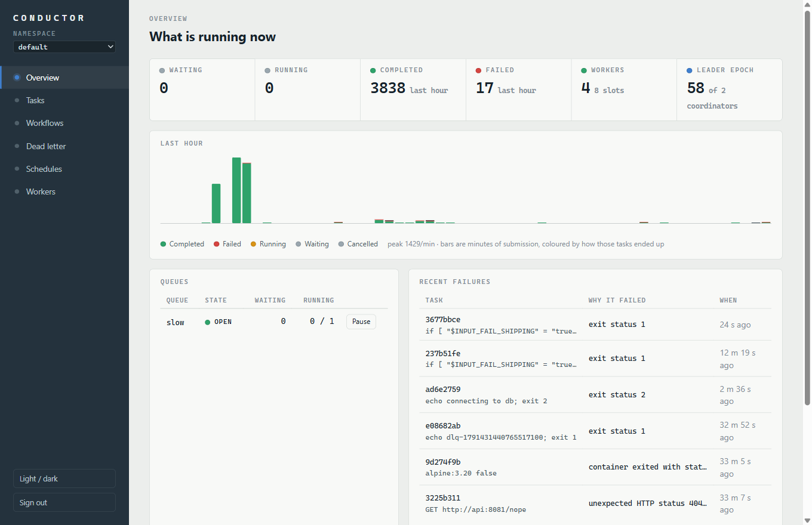

Found while checking it in a browser: a stray `0` rendered wherever a step had no outputs (`outputs.length && …`), inline `style` attributes silently refused by the CSP, and a sideways-scrolling page on phones (a grid track sized by its content, fixed with `minmax(0, 1fr)`).

### Phase 4 scorecard

| Exit criterion | Result |
|---|---|
| A failed workflow can be diagnosed from the dashboard alone: which step failed, why, and what was compensated | ✅ One banner states all three; the failed step opens with its error and output; the diagram shows the undo |

---

## What's next

Phase 5, AI-native durable execution: LLM steps with retries and token budgets, agent loops as durable workflows, and an "explain this failure" assistant built on the attempt history and traces added here. See [plan.md](plan.md).
