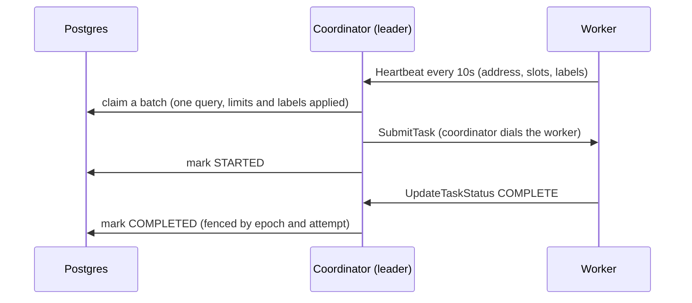

# ADR 0001: Dispatch, push or pull

- **Status:** Accepted (Phase 3). The transport change is scheduled, see [Consequences](#consequences).
- **Context date:** October 2026, after the Phase 3 performance work

## Context

Today the coordinator **pushes** work. It claims tasks from Postgres, picks a
worker with a free slot, and calls `SubmitTask` on that worker's gRPC server.
The worker reports results back to the coordinator.

The plan asked whether workers should **pull** instead. There are two
quite different things that "pull" can mean:

- **A. Workers claim from Postgres themselves** (`SELECT … FOR UPDATE SKIP LOCKED`
  in each worker, as River, Oban and graphile-worker do). The coordinator
  leaves the hot path.
- **B. Workers pull from the coordinator** over a connection they open: a long
  poll or a bidirectional stream. The coordinator still decides what runs where.

## What the measurements say

The Phase 3 profiling ([BENCHMARKS.md](../../BENCHMARKS.md), [DEVLOG](../../DEVLOG.md#phase-3-distributed-systems-depth))
found where the time per task goes:

| Cost per task | Push (today) | Pull A (workers claim) | Pull B (worker stream) |
|---|---|---|---|
| Insert | 1 statement | 1 | 1 |
| Claim | 1/batch, from one leader | 1 per worker poll | 1/batch, from one leader |
| STARTED + COMPLETED | 2 single-statement, fenced writes | 2 | 2 |
| Transport | coordinator dials worker | none (worker ↔ Postgres) | worker-opened stream |

- Every limit we hit and removed was **in Postgres**: NOTIFY serializing
  commits, the connection pool forking backends, four round trips per fenced
  write, and the pool queueing behind them. The gRPC send to a worker was
  never the bottleneck. Measured under load, a whole batch's sends took
  about 9 ms, against 18–28 ms for the claim.
- The database work per task is **the same in all three designs**. Pull
  doesn't make tasks cheaper. It only moves where the claims come from.

## Options

### A. Workers claim from Postgres

For:
- No coordinator on the hot path. Throughput scales with Postgres alone.
- Simplest possible deployment for small installs.

Against:
- **Every worker needs database credentials.** Since Phase 1, workers never
  see them, because workers run user code (and `container` tasks) and are the
  least trusted part of the system. This would undo that.
- **Connections multiply.** At 50 workers even a pool of 2 is 100
  connections, which is Postgres's default limit, before the API and
  coordinators. A connection pooler (PgBouncer) becomes mandatory.
- **Scheduling stops being central.** Queue concurrency and rate limits,
  namespace quotas, label routing and priority aging are one query today
  (`PickTasks`) evaluated by one leader. With N pollers they race. The limits
  still hold, since they are checked under row locks, but fairness across
  workers and queues becomes emergent rather than designed.
- **Polling load.** Idle workers poll an empty queue, or every worker LISTENs.
  The leader already does both, once.
- Fencing moves from one leader epoch to N workers. Attempt IDs still
  protect results, but every worker would need its own fencing story.

### B. Workers pull from the coordinator over a stream

For:
- **NAT- and firewall-friendly.** Workers only make outbound connections, so
  they can run on laptops, in other VPCs, or behind a load balancer. Workers
  no longer listen on a port.
- **No address detection.** Today a worker must advertise an address the
  coordinator can dial. The Phase 3 partition test showed the fragile part:
  reconnecting a container may change its IP, and the worker must restart to
  notice. A stream has no address.
- **Faster failure detection.** A broken stream is noticed at once, where a
  missed heartbeat takes 30 s today. Lost tasks are retried sooner.
- Keeps everything good about central scheduling: one claim query, one
  fencing epoch, one place for limits and fairness.
- On failover, workers simply reconnect through `coordclient`, which already
  follows "not the leader" redirects.

Against:
- One long-lived stream per worker on the leader. That is fine into the
  thousands with gRPC/HTTP2.
- A protocol change. Old workers need the unary API for a release.

### C. Keep push as is

Works and is fast, but keeps the inbound-port requirement and the
address-detection fragility.

## Decision

1. **Scheduling stays central.** The leader coordinator keeps claiming
   tasks (option A is rejected). Workers never get database credentials, and
   limits, fairness and fencing stay in one place. The numbers show pull
   wouldn't make tasks cheaper, because the cost is in Postgres either way.
2. **The transport moves to worker-initiated streams (option B)**: a
   bidirectional `Connect` stream. The worker sends its slots, labels and
   results; the leader sends tasks and cancellations. This is "push over a
   pull connection": dispatch latency stays at one hop, and workers no longer
   need to be reachable.

## Consequences

- The unary `SubmitTask`/`CancelTask` worker API and the heartbeat RPC stay
  until the stream lands, then remain for one release for compatibility.
- The stream also replaces the 10 s heartbeat for liveness, so a dead worker
  is detected in seconds rather than 30 s.
- The change is scheduled with the Kubernetes work (plan Phase 6), where
  workers behind Services and autoscalers make inbound addressing hardest.
  It doesn't block anything before then.
- Should Conductor ever need throughput beyond one Postgres primary, neither
  push nor pull is the answer; sharding queues across databases is. That's
  out of scope.
